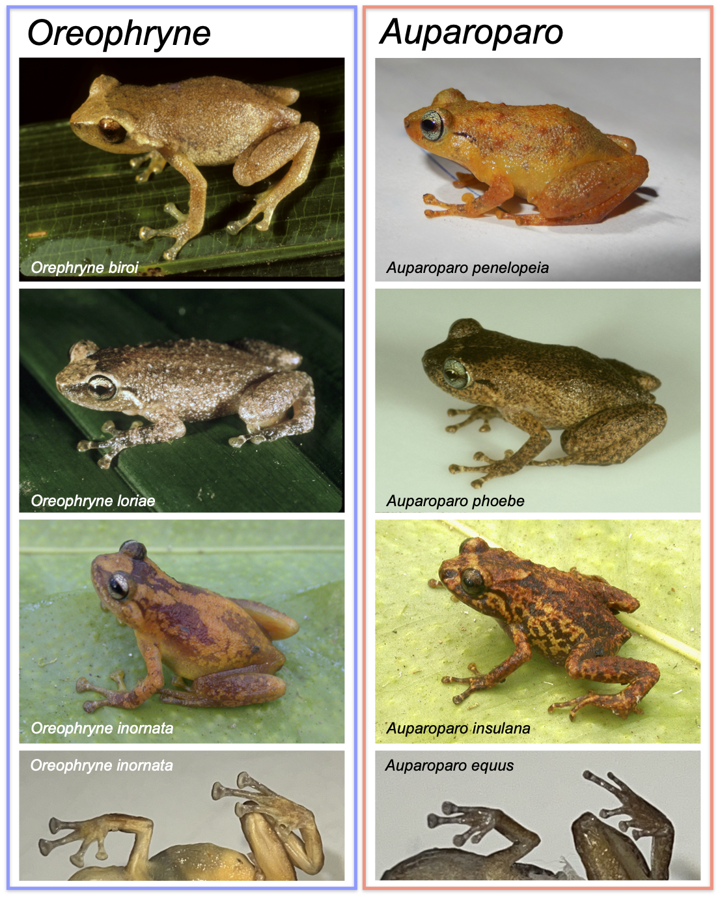
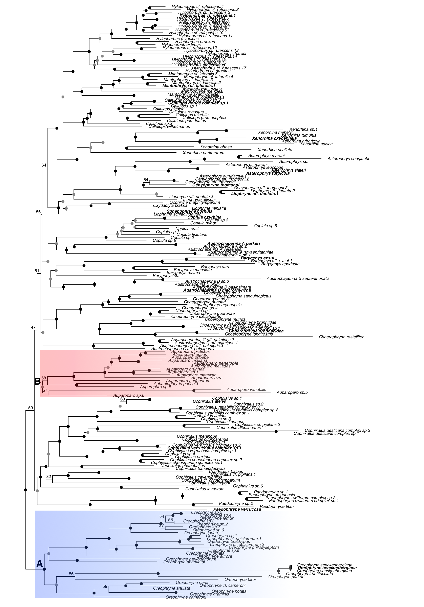
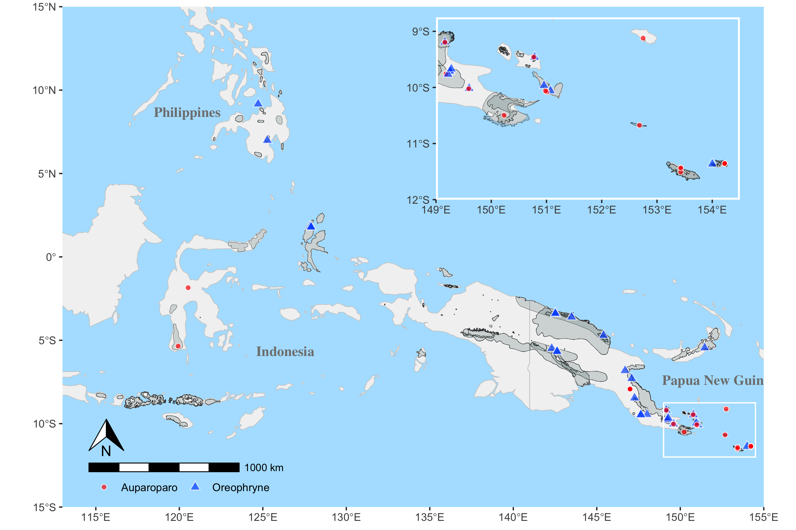


# Abstract

Although cryptic species are known to underestimate biodiversity, cryptic genera may present greater challenges for evolutionary studies. Surprisingly there remain long-standing groups that contain unrecognized polyphyly because they are morphologically undiagnosable.
As new species are described, even when molecular phylogenetic analysis is included, the only way to identify cryptic polyphyly is via the inclusion of appropriate outgroups -- however, there are no clues that there are any problem with monophyly. Absent appropriate outgroups, the resulting phylogenies may falsely appear to contain a single monophyletic group, leading to the growth of cryptic polyphyletic groups. One example is the frog genus _Oreophryne_, recently discovered as polyphyletic despite 130 years of research. Here we show that the two clades are morphologically undiagnosible and define the clades using phylogenetic taxonomy. We include the type species _O. senckenbergiana_, resolving which clade retains the name _Oreophryne_, and name the strikingly similar genus of arboreal frogs **_Auparoparo_ gen. nov.** from the indigenous Papuan language Motu. Their geographic distributions implicate plate tectonic activity in diversification, with _Oreophryne_ distributed from the Philippines to Indonesia, along central to south New Guinea and its satellite islands, whereas _Auparoparo_ occurs in Sulawesi and southern New Guinea and satellite islands where there is range overlap.  We caution that groups with unrecognized polyphyly are still in use today, renewing a call for careful confirmation of monophyly to promote nomenclatural stability and improve the accuracy of evolutionary conclusions.  




# Introduction

_Oreophryne_ [@Boettger:1895] is the oldest and arguably the best studied genus of the hyperdivsere subfamily Asterophryinae. Well known for its aboreal morphology and lifestyle, the taxonomy of the genus _Oreophryne_ as currently recognized has been stable over the past century, until it was recently discovered that the single large clade is, in fact, two independently evolved clades [reviewed in @Hill:2022].  A natural question is how did this happen and why did it remain undiscovered for so long? One obvious answer is that their morphology is remarkably similar (@fig-photos).  _Oreophryne_ are consipicuously arboreal and account for nearly all arboreal species of Asterophryinae [@Menzies:2006;@Gunther:2001], inhabiting lowland to montane rain forest, although there is a small group of diminutive, high-elevation, grassland species, a few of which are terrestrial [@Zweifel:2005;@Gunther:2012;@Putri:2023]. In short, _Oreophryne_ are morphologically distinctive, consistent with their arboreal lifestyle, and appear in the field to be a natural group preserved by niche conservatism.  

Although the taxonomic instability is well known in the history of the subfamily Asterophyinae [reviewed in @Rivera:2017;@Hill:2022], it appeared that _Oreophryne_ was united by a useful  diagnostic character distinct from all other genera. Based on a pectoral anatomy with highly reduced and distinctly curved clavicles [@Parker:1934;@Zweifel:2003], hypothetical new species could be assigned to _Oreophryne_, and for modern studies, confirmed by phylogenetic analysis with other members of _Oreophryne_. Over the past 130 years the genus _Oreophryne_ has grown to 75 currently recognized species, fully 1/5 of the total diversity of subfamily Asterophryinae and the largest of the ~16 genera [@Frost:2024;@Hill:2022]. _Oreophryne_ as currently recognized has the largest geographic distribution in the subfamily [@Hill:2023a], with species centered on mainland New Guinea and its offshore islands [@Zweifel:2003a;@Frost:2024;@Zweifel:1956;@Kraus:2004;@Kraus:2009;@Kraus:2013;@Werner:1898;@Zweifel:2003a], but ranging westward to distant oceanic islands [@Muller:1894;@Boulenger:1896;@Ahl:1933;@Putri:2023] and northward to Indonesia [@Boettger:1895;@Setiadi:2010;@Gunther:2023] and the Southern Philippines Islands [@Alcala:1986;@Balinton:2015]. 

The apparently reliable diagnostic character, however, has never been demonstrated to be a synapomorphy, and recent studies have not found evidence for monophyly [@Rivera:2017;@Zweifel:2005]. Recently, Hill et. al [-@Hill:2022;-@Hill:2023] established that _Oreophryne_ sensu lato represents two reciprocally monophyletic groups that are not sister taxa (@fig-phylo), temporarily labeled "_Oreophryne_ A" and "_Oreophryne_ B". Furthermore, it is unknown whether it is possible to identify these groups with any morphological characters -- there may in fact be no reliable diagnostic characters, rendering phylogenetic taxonomic definitions for each clade an imperative for evolutionary study. The aims of this study are to assess the phylogenetic position of the newly available type species of _Oreophryne_ (_Oreophryne senkenbergiana_) to name and describe the new genus, and to develop phylogenetic definitions for both clades in the context of the subfamily-level Asterophrinae phylogeny including representatives from all known genera. Furthermore, we analyze the morphological characteristics to assess whether morphological diagnosis is possible, and consider whether there are any additional features to assist collectors when identifying putative _Oreophryne_ in the field (e.g., call type, geography, other characters), and discuss the implications of having misleading diagnostic characters for evolutionary studies. Inclusion of samples in molecular phylogenetics is not enough, and indeed it is necessary to include explicit tests of monophyly when proposing a new taxonomy.  


#### Taxonomic History:
@Boettger:1895 described the genus _Oreoprhyne_ and the species _Oreophryne senckenbergiana_ on the basis of two specimens from Halmahera Island, in the Maluku Archipelago west of New Guinea, that lacked procoracoids and had cartilaginous sterna. He also noted the presence of expanded finger pads and transverse folds of skin in the palate. @Parker:1934 noted that procoracoids were present, but were reduced and re-diagnosed the genus on the basis of this feature together with the presence of reduced clavicles, no omosternum, and a large cartilaginous sternum. @Zweifel:2003 noted that “the clavicles are tiny, slightly curved bones lying on (ventral to) the procoracoid cartilage and apart from the midline and the scapula.” On the basis of these features there are now 75 recognized species in the genus [@Frost:2024].


```{r}
#| label: fig-photos
#| out-width: 80%
#| fig-cap: "Photos of _Oreophryne_ species on the left, _Auparoparo_ species on the right. Both genera are aboreal with a few exceptions as noted in the text, and contain nearly all arboreal species within Asterophryinae. Comparison of finger and toe pad sizes in _Oreophryne inornata_ BPBM16217 vs. _Auparoparo equus_ BPBM15775, bottom row."
#| echo: FALSE

```

While _Oreophryne_ sensu lato is morphologically similar (@fig-photos), large scale molecular phylogenetic analysis with many ingroup samples were required to clarify that this group contains two reciprocally monophyletic clades that are not sister taxa [@Hill:2022;@Hill:2023]. Early molecular phylogenetic studies suggested monophyly but only included a few taxa within a larger-scale study [@Koehler:2008 included 9 _Oreophryne_ species;@deSa:2012 included 4]. @Rivera:2017 provided the first molecular evidence of a polyphyletic _Oreophryne_ with 36 _Oreophryne_ species within a larger phylogeny Asterophryinae which included 155 samples, followed by @Tu:2018’s sparse supermatrix approach with 18 species of _Oreophryne_ falling out in various places within a much larger phylogeny, but both of these lacked strong nodal support connecting the hypothesized clades to the backbone of the phylogeny. The polyphyletic nature of _Oreophryne_ sensu lato was not clearly demonstrated until Hill et. al [-@Hill:2022;-@Hill:2023] included 44 species of _Oreophryne_ (with data 96% complete for sampled loci) within a 218 taxon phylogeny of Asterophryinae. This phylogeny is the  most complete and robust phylogeny to date. The two clades, labeled "_Oreophryne_ A" and "_Oreophryne_ B" have deep histories of ~ 18MY and ~16MY, respectively, with "_Oreophryne_ A" sister to the rest of the subfamily [-@Hill:2022;-@Hill:2023].

# Materials and Methods

## Taxon Sampling
Asterophryinae is an adaptive radiation with short branch lengths along the backbone separating currently recognized genera [@Rivera:2017;@Hill:2022;@Hill:2023]; we reconstruct the phylogeny of _Oreophryne_ sensu lato within the larger context of the subfamily. We include 30 named species and 18 unnamed species of _Oreophryne_ within a larger dataset of 234 samples of 203 species of Asterophryinae collected across New Guinea, the Philippines, and Indonesia with three outgroup species to root the phylogeny (_Dyscophus antongilii_, _Scaphiophryne marmorata_, and _Platypelis grandis_). Importantly, we include the type species _Oreophryne senckenbergiana_ [@Boettger:1895] in a molecular phylogeny for the first time. The samples were collected in Halmahera, North Maluku Province, Indonesia by Iqbal Setiadi [@Setiadi:2010; @tbl-localities], near the type locality for _O. senkenbergiana_ [Halmahera, Indonesia as documented by @Boettger:1895].

```{r, results="asis"}
#| label: tbl-localities
#| tbl-cap: Locality information for samples sequenced in this study. See Hill, et al., 2023, Table 1 for additional metadata.
#| echo: FALSE
#| warning: FALSE
#readRDS("../Data/Processed_data/localities.RDS")
library(tidyverse)
library(flextable)
library(officer)
library(dplyr)
set_flextable_defaults(
  theme_fun = theme_booktabs,
  big.mark = " ",
  font.color = "#666666",
  border.color = "#666666",
  padding = 2,
)
landscape_properties <- prop_section(
  page_size = page_size(
    orient = "landscape",
    width = 8.3, height = 11.7
  ),
  type = "continuous",
  page_margins = page_mar()
)

portrait_properties <- prop_section(
  page_size = page_size(
    orient = "portrait",
    width = 8.5, height = 11
  ),
  type = "continuous",
  page_margins = page_mar()
)

dat <- read.csv("../Data/Raw_data/locality.csv")

dat |>
  flextable() |>
  separate_header() |>
  italic(part="body", j=c("Species")) |>
  autofit() |>
  set_header_labels(Latitude.Longitude = "Latitude, Longitude")
```

### Molecular Sequence
We obtained nearly complete DNA sequence data for five loci (three nuclear: Seventh in Absentia [SIA], Brain Derived Neurotrophic Factor [BDNF], Sodium Calcium Exchange subunit-1 [NXC-1], and two mitochondrial loci (Cytochrome oxidase b [CYTB], and NADH dehydrogenase subunit 4 [ND4] from four samples of two species not previously sequenced and combined these with previously published data [@Rivera:2017; @Hill:2022; @Hill:2023] for a dataset of 240 samples with 207 species and 2475 base pairs that is 96% complete. All loci were complete for the added samples.  Sequence quality was evaluated using chromatogram quality scores, checks for stop codons indicating pseudogenes, BLAST searches [@Ye:2012], and concordance of pairwise similarities with other Asterophryinae sequences. Primer sequences and detailed methods are provided in [@Hill:2023]. We note that we excluded from the previous alignment [@Hill:2022; @Hill:2023] two samples of _Aphantophryne pansa_ (BPBM 5299 and BPBM 8312) which were deemed unreliable as they came from formalin-fixed material, and three samples which fell out in odd places that should be confirmed with new material prior to recommending taxonomic revision (BPBM 22708 _Copiula tyleri_, BPBM 38939 _Copiula sp. 7_, BPBM 37753 _Paedophryne dekot_). We note that genetic material from 47 species of _Oreophryne_ sensu lato was not available for this molecular analysis.

### Morphology, Behavior, and Geographic Distribution
We collected new morphological characters and reexamined traits compiled from the literature [@Boettger:1895; @Parker:1934; @Kraus:2016; character states defined in Table @tbl-morphcharacters] for all named species of _Oreophryne_ in our phylogenetic dataset. Our sample included all species available in the collections of the Bishop Museum, Honolulu, Hawaii (BPBM): thirteen species of "_Oreophryne_ A", eight species "_Oreophryne_ B" (@tbl-morph). Finger and toe pads were photographed and length and width of the toe tips were measured using ImageJ software. Trait information for the remaining species were gathered from the literature, six species of _“Oreophryne_ A” and one of "_Oreophryne_ B". In addition, we compiled information on call type from the literature and collection location from the respective collectors or the BPBM database (global positioning coordinates [GPS]; @tbl-morph). We examined the ability of morphological and behavioral characters to provide a diagnosis to the two _Oreophryne_ clades consistent with molecular phylogenetics.


```{r, results="asis"}
#| label: tbl-morphcharacters
#| tbl-cap: "Description of traits surveyed."
#| echo: FALSE
readRDS("../Data/Processed_data/character_key.RDS")
```

## Nomenclature
We conducted a comprehensive taxonomic literature review of diagnoses for all species known to belong to the clades "_Oreophryne_ A" and "_Oreophryne_ B" [@Hill:2022]. We applied the ICZN code [@ICZN:1999] as well as the Phylocode [@deQueiroz:2020].  We support the nascent effort to assign indigenous names in taxonomy whenever possible [e.g., @Gillman:2020]. One of us (B. Iova) provided guidance in proposing the novel genus name, _Auparoparo_, meaning “tree frog” in Motu, an indigenous language of Papua New Guinea, for _Oreophryne_ "B".

## Phylogenetic Reconstruction
We used Partitionfinder in IQTREE2 to find the best-fit evolutionary model followed by Maximum Likelihood (ML) phylogenetic reconstruction [@Lanfear:2012; @Minh:2020 ]. Following @Hill:2022, we tested models partitioned by both locus and codon versus by loci only (15 vs. 5 partition scheme) with merging of partitions allowed. We found following merging that a 10-partition scheme involving locus and codon models with merged partitions was superior by the Akaike Information Criterion (models by partition included in Supplementary Materials). Nodal support values for the ML tree were inferred using 2000 bootstrap replicates.

## Phylogenetic Definition
We use a maximum crown-clade definition under the PhyloCode [@deQueiroz:1990; @deQueiroz:1992; @deQueiroz:2020], specifically, the largest crown clade originating with the most recent common ancestor of the reference species for the clade (e.g., the type species of the genus), and all extant  species that share a more recent common ancestor with that reference species then they do with reference species of other clades (i.e., in this study, type species of other genera or their proxies). This definition is robust to uncertainty in basal relationships such as in the case of adaptive radiations with short branch lengths along the backbone as in Asterophryinae, as well as being robust to identification of new species and new clades.

## Analyses, Visualization, and Data Availability
All analyses were conducted and graphics produced in the R Statistical Computing Environment unless noted below [@R:2024].  Initial DNA sequence alignment was conducted using `MUSCLE` [@Edgar:2004] with manual adjustments in `Mesquite` [@Maddison:2023]. Phylogenetic reconstruction was conducted using the `IQTREE2` suite of software [@Lanfear:2012; @Minh:2020].

The known ranges of _Oreophryne_ sensu lato were downloaded as shape files from the @IUCN:2025 redlist database, and sites from collection locations for _Oreophryne_ and _Auparoparo_ were mapped using the `sf` and `ggplot2` packages [@Pebesma:2018;@Wickham:2016], overlaid on a basemap created using `rnaturalearth`, `grid`, and `ggspatial` packages [@Massicotte:2023; @Dunnington:2023].  Tree graphics were produced with the `ggtree` package [@Yu:2017;@Yu:2020] supplemented by `ggplot2` [@Wickham:2016]. All data, alignments, model and tree outputs, and code to reproduce analyses are available in the public repository ...


# Results

## Phylogeny and Phylogenetic Taxonomy

For our subfamily-level phylogeny, a partition scheme including codon as well as locus resulted in an improvment of fit by 3,127 AIC units (evolutionary model partitioned by locus and codon, 15-partitions:  AIC of 155,492, versus partitioned by locus only, 5 partitions: AIC of 158,619). Unless otherwise noted, all phylogenetic reconstructions used the 15-partition scheme identified as best-fit by IQTREE2.

We recovered a maximum likelihood topology that confirms that _Oreophryne_ sensu lato is polyphyletic, with species falling into two independently-evolved, reciprocally monophyletic, highly-supported clades that are not sister groups [@fig-phylo; @Hill:2022; @Hill:2023]. Nearly all nodes are moderately or highly supported, with most of the weakly supported nodes falling along the backbone where there are very short branch lengths as characteristic of an adaptive radiation.

Furthermore, these findings demonstrate that the clade descended from node A should retain the name _Oreophryne_, as the type species, _O. senckenbergiana_, from North Maluku Island, Indonesia, is situated within _Oreophryne_ with high support (@fig-phylo). We propose the new clade name _Auparoparo_ for the clade descended from node B.  _Oreophryne_ is the earliest diverging genus-level clade in the Papuan subfamily, with genera _Cophixalus_ and _Paedophryne_ arising before _Auparoparo_, which split from the remaining genera of Asterophryinae.



```{r}
#| label: fig-phylo
#| fig-cap: "Molecular phyogenetic hypothesis of Asterophryinae showing polyphyly of _Oreophryne_ sensu lato, into two reciprocally monophyletic clades that are not sister taxa. Node A is _Oreophryne_ (blue clade) and node B is _Auparoparo_ (red clade) based on the position of the type species _Oreophryne senkenbergiana_. Nodal support: black dots indicate ML boostrap support >= 95%, grey dots >= 75%, numeric values given for nodes below 75% support. Outgroup taxa excluded. Taxa in bold are the type species for each genus (or a proxy species used as an internal reference)."
#| echo: FALSE

```

## Morphology, Behavior, and Ranked Taxonomy

We find no morphological synapomorphies that distinguish _Auparoparo_ from _Oreophryne_. _Oreophryne_ sensu lato is diagnosed by characters of the pectoral girdle: posessing highly reduced, curved procoracoid cartilages and clavicles, and lacking an omosternum [@Parker:1934; @Zweifel:2003]. We found that this suite of characters is present in both _Oreophryne_ and _Auparoparo_,  and therefore is not diagnostic for either _Oreophryne_ or _Auparoparo_ (@tbl-morph).

Two traits imperfectly segregate between the clades, relative finger and toe pad widths and call type (@tbl-morph), which may assist in preliminary identification.  Both _Oreophryne_ and _Auparoparo_ are arboreal clades with expanded digital pads. Whereas _Oreophryne_ have finger and toe pads of roughly equal width, _Auparoparo_ have visibly larger finger pads, with finger pads roughly 20-30% wider than toes. Both _Oreophryne_ and _Auparoparo_ use a variety of call types, with "honks" or "peeps" used only by _Oreophryne_, whereas "whinny" calls are used only by _Auparoparo_. A minority of species in both groups use the "rattle" call type. However, both toe pad width and call type are variable traits with some overlap and thus not unambiguosly diagnostic. Furthermore, possesssion of expanded digital pads is clearly an adaptive trait for arboreality and prone to homoplasy.

```{r, results="asis"}
#| label: tbl-morph
#| tbl-cap: "Morphological character matrix."
#| echo: FALSE
readRDS("../Data/Processed_data/character_matrix.RDS")
```

## Geographic Distribution

_Oreophryne_ has a wide distribution with species spanning from the southern Philippines to the Papuan Louisade Archipelago (@fig-map, localities for _Oreophryne_ species included in our phylogeny are mapped with blue triangles). This range encompasses the additional species from the type locality in Indonesia. _Auparoparo_ is mainly clustered in the southeastern tip of mainland Papua New Guinea and its satellite islands with two species in Sulawesi, an Indonesian island (@fig-map, _Auparoparo_ localities mapped in red circles). We also mapped _Oreophryne_ sensu lato ranges obtained from the IUCN Red List [@IUCN:2025], which require phylogenetic diagnosis. Note the Indonesian region of New Guinea is difficult to attain samples from and it is unknown whether these groups inhabit this connective area.

```{r}
#| label: fig-map
#| out-width: 100%
#| fig-cap: "The known distribution of _Oreophryne_ as currently recognized is plotted in grey polygons [data source @IUCN:2025], with points indicating _Auparoparo_ (red) and _Oreophryne_ (blue) as assigned by our phylogenetic analysis @fig-phylo. Note that there is range overlap along the East Papuan Composite Terrane and on some offshore islands (see inset)."
#| echo: FALSE

```

## Taxonomy
We use a maximum crown-clade definitions for designating _Oreophryne_ and _Auparoparo_ because the monophyly of these taxa are strongly supported, and the relationships of these taxa to each other and to other genera of Asterophryinae are well-supported [this study, @Hill:2022; @Hill:2023], as has been done for other anuran taxa [@Brown:2015] following the methods of phylogenetic nomenclature [@deQueiroz:1990; @deQueiroz:1992; @deQueiroz:1994]. That is, we adopt phylogenetic definitions of these genera that explicitly identify them as clades. Specifically, we define each genus to include all descendants of the most recent common ancestor of the type species and all other extant species that are more closely related to it than to the type species of the other Asterophryine genera recognized here. This definition is robust to uncertainty in basal relationships such as in the case of adaptive radiations with short branch lengths along the backbone as in Asterophryinae, as well as being robust to identification of new species [[Find citation]].  We retain the name _Oreophryne_ for species included in the phylogenetic redefinition of _Oreophryne_, and new clade name _Auparoparo_ for newly designated species of _Auparoparo_. The previously defined polyphyletic _Oreophryne_ is indicated by "sensu lato", which contains many species which require molecular phylogenetic assignment.

__Family _Microhylidae_ Günther 1858__  
__Subfamily _Asterophryinae_ Günther 1858__  
__Genus _Oreophryne_ Boettger 1895 amended__  
_Microhyla_ Peters 1878  
_Callula_ (Horst 1883)
_Oreophryne_ Boettger 1895 Type species: _Oreophryne senckenbergiana_ Boettger 1895. (= _Microhyla achatina_ var. _moluccensis_ Peters 1878, by monotypy) Placed on Official List of Generic Names in Zoology by Opinion 1266, Anonymous, 1984.     
_Sphenophryne_ in part (Méhely 1897)
_Phrynixalus_ (Stejneger 1908) 
_Mehelyia_ Wandolleck 1911, Type species: _Meheylia lineata_ Wandolleck 1911  (=_Sphenophryne biroi_ Mehely 1897, by subsequent designation of Parker 1934. Synonymy by Nieden (1926).   
_Cophixalus_ in part (Boettger 1892)  
_Chaperina_ in part (Taylor 1920)  

__Diagnosis:__ We note that there are no synapomorphies in adult _Oreophryne_ that differ from the morphologically similar genus _Auparoparo_. Diagnoses should be made by molecular phylogenetic analysis, based on the phylogenetic definition below. _Oreophryne_ differs from most other genera in subfamily Asterophryinae, but not from _Auparoparo_, by the combination of (1) presence of highly reduced clavicles (vs absence or elongate) which have a distinctly curved shape; (2) presence of well developed digital pads, often with finger and toe pads of similar size; (3) arboreal lifestyle (perch height >2m above ground); (4) most species range in body size from 16mm [_O. graminis_, @Gunther:2012] to 30mm, with a few larger species ~40mm (_O. inornata_); (5) small to invisible tympanum; (6) large eyes with horizontal pupils; (7) occasional presence of toe webbing; (8) thin, elongated limbs; and (9) in many species males that call with "honk" or "peep" types or in some species "rattle" type. Some species of _Oreophryne_ may be distinguished from _Auparoparo_ by roughly equal finger to toe pad ratio and males calling with "honk" or "peep" but not "whinny" call types.

__Phylogenetic definition:__ _Oreophryne_ Boettger 1895 (Converted Clade Name) is defined as the largest crown clade including _Oreophryne senckenbergiana_ Boettger 1895 and excluding the type species of the other genus-ranked clades listed in Table @tbl-genus-types.

```{r, results="asis"}
#| label: tbl-genus-types
#| tbl-cap: "Genus-level clades of Asterophryinae and their internal specifiers (type species or proxies)."
#| echo: FALSE
readRDS("../Data/Processed_data/genus_types.RDS")
```
__Composition:__ Our results support the retention of 17 species in _Oreophryne_ with molecular evidence (@tbl-transfers): _Oreophryne anamiatoi_ Kraus 2009, _O. anulata_ (Stejneger 1908), _O. aurora_ Kraus 2016, _O. biroi_ Mehely 1897, _O. brachypus_ Werner 1898, _O. cameroni_ Kraus 2013, _O. geislerorum_ Boettger 1892, _O. graminis_ Gunther 2012, _O. inornata_ Zweifel 1956, _O. lemur_ Kraus 2016, _O. loriae_ Boulenger 1898, _O. nana_ Brown 1967, _O. notata_ Zweifel 2003, _O. parkeri_ Loveridge 1955, _O. parkopanorum_ Kraus 2013, _O. philosylleptoris_ Kraus 2016, and _O. senckenbergiana_ Boettger 1895. A number of species were not available for our study but should molecular evidence demonstrate their relationship within _Oreophryne_, those species should also retain their generic identity.

__Distribution:__ The range of confirmed _Oreophryne_ species in this dataset remains nearly as broad as previously defined (@fig-map), from the Philippines and Indonesia to the southeastern most tip of mainland New Guinea and several near-shore islands (Fergusson, and Normanby Is.) and the distant Rossel Island of the Louisiade Archipelago. However, the transfer of species which occupy Woodlark Islands and Misima and Sudest Islands of the Louisaide Archipelago reduces the known range of _Oreophryne_. Woodlark Island is inhabited by _O. phoebe_ [=_Auparoparo phoebe_], Misima Island is inhabited by _O. picticrus_ [=_Auparoparo picticrus_], and Sudest Island is inhabited by _O. ezra_ and _O. meliades_ [= _Auparoparo ezra_ and _Auparoparo meliades_].

__Genus _Auparoparo_ gen. nov.__  
_Oreophryne_ in part [@Boettger:1895]  
_Sphenophryne_ in part [@Boulenger:1897]  
Type species _Oreophryne penelopeia_ [@Kraus:2016] [=_Auparoparo penelopeia_]  

__Diagnosis:__ Currently, there are no known synapomorphies in adult _Auparoparo_ that differ from the morphologically similar genus _Oreophryne_. Diagnoses should be made by molecular phylogenetic analysis, based on the phylogenetic definition below. _Auparoparo_ differs from most other genera in subfamily Asterophryinae, but not from _Oreophryne_, by the combination of (1) presence of highly reduced clavicles (vs absence or elongate) which have a distinctly curved shape; (2) presence of well developed digital discs, with finger discs notably wider than toe discs (typically 20% or more); (3) arboreal lifestyle (perch height >2m above ground); (4) small to moderately large body size in known species, from 16mm (_A. brunnea_ Kraus 2017) to 25 mm (_A. picticrus_ Kraus 2016); (5) small to invisible tympanum; (6) large eyes with horizontal pupils; (7) occasional presence of toe webbing; (8) and thin, elongated limbs; and (9) and in many species males that call with a "whinny" call type or in some species "rattle" type. Some species of _Auparoparo_ may be distinguished from _Oreophryne_ by larger finger pads than toe pads and males calling with "whinny" but not "honk" or "peep" call types.

__Phylogenetic definition:__ _Auparoparo_ (New Clade Name) applies to the largest crown clade including _Auparoparo penelopia_ (Kraus 2016) and excluding the type species of the other genus-ranked clades listed in @tbl-genus-types.

__Composition:__ We transfer eleven named species from _Oreophryne_ into _Auparoparo_ (@tbl-transfers): _Auparoparo brunnea_ [@Kraus:2017], _A. equus_ [@Kraus:2016], _A. ezra_ [@Kraus:2009], _A. insulana_ [@Zweifel:1956], _A. matawan_ [@Kraus:2016], _A. meliades_ [@Kraus:2016], _A. penelopeia_ [@Kraus:2016], _A. phoebe_ [@Kraus:2017], _A. picticrus_ [@Kraus:2016], _A. penelopia_ [@Kraus:2016], _A. variabilis_ [@Boulenger:1896].

__Distribution:__ Southeastern tip of mainland Papua New Guinea and satellite islands (Fergusson, Misima, Normanby, Rossel, Sudest, Woodlark Is.), Sulawesi.

__Etymology:__ The generic name _Auparoparo_ comes from the indigenous language, Motu, which is widely spoken in the region of Papua New Guinea in which this genus is found. It is a combination of the words "au" (tree) and "paro paro" (frog). Motu is not a gendered language, however, for nomenclatural purposes we designate the genus _Auparoparo_ as feminine, thereby preserving the gender of existing species names.


# Discussion

Our phylogenetic results [@Hill:2022; -@Hill:2023, this study] provide clarity on the classification of the problematic genus _Oreophryne_ sensu lato. We confirm that _Oreophryne_ sensu lato is polyphyletic and consists of two reciprocally monophyletic clades that are not sister taxa (@fig-phylo). Here we designate "_Oreophryne_ A" in @Hill:2022 as the genus _Oreophryne_ because it contains the type species _Oreophryne senckenbergiana_ Boettger 1895 with high support. _Oreophryne_ is the earliest diverged genus in subfamily Asterophryinae originating approximately 18 MYA [@Hill:2022], and is sister to a clade composed of all the other genera. The second clade, "_Oreophryne_ B" in @Hill:2022, is highly supported as a separate, non-sister genus, which originated approximately 16 MYA and contains no known species that are the types of any previously proposed genera. Thus, we designate this genus as _Auparoparo_, a tribute to the Motu language of the indigenous peoples of the region.

## The Difficulty with Cryptic Genera: Can we tell them apart?

Perhaps the greatest testament to the crypticism of _Oreophryne_ vs. _Auparoparo_ is that no taxonomist was able to distinguish that they are separate clades, independently evolved, in the 130 years between their discovery and the present classification [@Boettger:1895; this study]. These species are indeed morphologically very similar (@fig-photos) and our results provide some clues as to why _Oreophryne_ taxonomy has been so difficult.
We found morphological synapomorphies for neither _Auparoparo_ nor _Oreophryne_, and moreover, no morphological features that can diagnose either clade.

The traditional basis for assigning species to _Oreophryne_ has primarily relied on a signature pectoral anatomy [whether original or revised diagnosis, @Parker:1934; @Zweifel:2003]. Our phylogenetic results clearly show that this trait appears more than once, in both _Oreophryne_ and _Auparaparo_, is either a symplesiomorphy (shared ancestral character) or a result of convergent or parallel evolution, and perhaps adaptive for arboreality. Thus, the pectoral anatomy is not a reliable diagnostic character in differentiating between _Oreophryne_ and _Auparoparo_. In studies across a wide diversity of anurans, @Soliz:2025 found that anatomical variation of the pectoral girdle corresponds with functional and ecological lifestyle demands, whereas @Engelkes:2020 found strong phylogenetic influence in the shape of the pectoral girdle. The pectoral girdle would be excellent for further study within Asterophryinae, as there are high elevation terrestrial species of _Oreophryne_ sensu lato that possess the same pectoral trait [@Zweifel:2005], as well as a few arboreal species within other genera (_Cophixalus_, _Asterophrys_, _Xenorhina_) with unknown pectoral morphology.

We further rexamined additional characters previously used to diagnose _Oreophryne_ as well as characters conventionally used to diagnose species of frogs.  We conclude that pectoral girdle connector type [@Parker:1934] and relative lengths of the 3rd and 5th toe are uninformative and the degree of toe webbing is variable. It was previously suggested that species in _Oreophryne_ sensu lato could be divided into two groups based on possessing a cartilaginous or ligamentous connection between the procoracoid cartilages and the scapula [@Kraus:2013], with roughly half possessing each type [@Parker:1934]. However, we found that cartilaginous and ligamentous connectors are common across both genera (@tbl-morph); therefore, these traits are not synapmorphies for neither _Oreophryne_ nor _Auparoparo_ and do not indicate monophyly for these clades. Of species with toe webbing, _Oreophryne_ tends to be described as having “well webbed” toes compared to _Auparoparo_’s "basal" webbing (@tbl-morph). However, the presence of intra-specific variability combined with subjectivity in judging relative landmarks (e.g., “reaching the penultimate tubercle”, “webbed 1/3 length of 5th toe”, etc.), makes this feature difficult to standardize for generic diagnostic use. Many of the morphological traits proposed by @Parker:1934 and @Zweifel:2003 may in fact be a result of homoplasy via convergent lifestyle or parallel evolution, and while they may prove useful for ecomorphological identification or species diagnoses in combination with other traits, they are not informative for generic diagnosis.

We found only two characters with potential for imperfectly distinguishing the genera: relative digital pad size [@Parker:1934; @Zweifel:1956], and call type [e.g., @Kraus:2016]. The relative widths of the digit pads differs between genera: _Auparoparo_ tends to have visibly larger finger pads in comparison to toe pads, whereas in _Oreophryne_ the finger and toe pads are roughly equal in size (@fig-photos, bottom row), although there is some overlap in finger to toe pad ratio (@tbl-morph). In some cases, _Auparoparo_’s finger pads display T-shapes while the toes are often rounder and narrower. Whether there is any performance advantage in larger finger pads compared to toes is unknown. Furthermore, a handful of high-elevation _Oreophryne_ species not included in our phylogeny and yet to be diagnosed by molecular phylogenetic analysis have evolved terrestrial or fossorial habits and possess smaller digital pads compared to their presumed arboreal relatives [@Zweifel:2005].

Call features are increasingly used for diagnosing species of _Oreophryne_, with advertisement call types commonly categorized as rattle, honk, whinny, peeping, or clicking [@Kraus:2016]. We found honk or peep call types are only found in _Oroephryne_ species in our sample, while whinny calls are only found in _Auparoparo_ species, and rattle calls are found in both genera (@tbl-morph). We note that several authors described species of both genera, thus the difference between genera cannot be attributed to the investigator. However, more complete sampling may add further complexity. As far as we are aware there has been no comprehensive acoustic analysis across _Oreophryne_ sensu lato. More research is needed to explore call diversity both between species and across genera to undertand call evolution and whether there any features that are distinctive of genera.

## Geographic Distribution

Both _Oreophryne_ and _Auparoparo_ are geographically centered in the mainland New Guinea. _Oreophryne_ extends southward to the Louisiade Archipelago and northward to the South Philippine Islands [@Hill:2023]. Addition of the type species _Oreophryne senkenbergiana_ expands the known range eastward to North Maluku, Indonesia (@fig-map).

The known distribution of _Auparoparo_ is mainly clustered in the southeastern tip of mainland Papua New Guinea (in the East Papuan Composite Terrane) and satellite islands with two species in Sulawesi, Indonesia. This suggests the possiblity of of interesting plate tectonics resulting in this biogeographic distribution. Exploration of intermediate localities may result in as  yet undescribed or undiscovered species of _Auparoparo_. The geographic range is sure to grow with additional phylogenetic sampling. For example _Oreophryne_ (sensu lato) _chlorops_ [@Gunther:2023] is a very large (SVL > 40mm) species recently discovered from mid-elevation mountains of the birdʻs neck region of Western Papua with clearly enlarged finger pads relative to toe pads. If confirmed as _Auparoparo_, it would significantly expand the range of _Auparoparo_ across New Guinea Island.

We found geographic range overlap between _Oreophryne_ and _Auparoparo_ at multiple localities: on the mainland along the Mt. Dayman Foothills, at the Mt. Simpson Massif, Mt. Trafalgar, and on the oceanic islands of Normanby and Fergusson (both nearshore islands), and Rossel island (hundreds of kilometers offshore), which presents interesting questions regarding biogeography as well as their ecological relationships. For example, _Oreophryne inornata_ and _Auparoparo insulana_ have been collected at the same site (Goodenough Island) and even the same microhabitats [@Zweifel:1956]. Do these species occupy the same niche,  and what is the temporal history of each colonization? Are both genera also present in the nearby islands of Normanby and Fergusson (all part of the D’Entrecasteaux Archipelago)? Obtaining additional geographical samples for inclusion in phylogenetic analysis should be a high priority to gain a more complete understanding of the geographic distribution and evolutionary history of both _Oreophryne_ and _Auparoparo_.

## How to Avoid a Misleading Classification

We adopt an explicitly phylogenetic framework for the new taxonomy of the genera _Oreophryne_ and _Auparoparo_, and to our knowledge, this is the first time that phylogenetic nomenclature has been applied within the subfamily Asterophryinae. A phylogenetic definition of genera is advantageous especially because Asterophryinae is an adaptive radiation. While we are increasingly confident that at least 16 genera are indeed monophyletic, nevertheless, very short branch lengths separate many of the genera along the backbone [@Hill:2022; this study]. A maximum-crown-clade definition with multiple external specifiers is robust to uncertainty (i.e., rearrangements of order) along the backbone. We define each genus as the largest crown clade including the internal specifier species for the clade (i.e., the type species of the genus) but not the internal specifier species of other asterophryine genera. For long-studied groups such as Asterophryinae, it may not be possible to obtain a genetic sample for type species that were collected in the 1800ʻs and early 1900ʻs, as these locations may be uncertain and/or remote, it may be necessary to use a genetic sample from another species of the genus as a proxy for the type species.  Nevertheless, is increasingly clear that for _Oreophryne_ and _Auparoparo_, a molecular phylogenetic approach is required for final confirmation of taxonomy.

Furthermore, a phylogenetic definition provides guidance for robust classification. Given the deep histories of the two genera, it is imperative that molecular confirmation of a species to either _Oreophryne_ or _Auparoparo_ include not only members of the other clade, but also members of _Cophixalus_, _Paedophryne_, or other closely related genera to clearly resolve whether the sample shares an MRCA more closely with _Oreophryne_ or _Auparoaro_. The ability to resolve the "boundaries" of each monophyletic genus requires it. For example, a phylogenetic analysis with only _Oreophryne_ sensu lato and outgroups to Asterophryinae will show grouping of _Oreophryne_ and _Auparoparo_ species because of the lack of intervening species assigned to other Asterophryinae genera, particularly _Cophixalus_ and _Paedophryne_. An additional difficulty here is that within _Oreophryne_ and _Auparoparo_, there are subclades with deep histories [@Hill:2023a], so care must be taken to ensure correct assignment to genus. 

This study furthermore highlights the importance of taxonomic sampling for robust phylogenetic results. Developing an orderly taxonomy in a  clade with over 350 named species (with perhaps as much as 40% of species in museum collections that are yet to be described, A. Allison, unpublished) would be that much more challenging without the benefit of generic diagnoses that follow evolutionary history.

## Why the Names Matter

Clarifying the generic structure also facilitates appreciation for the patterns of diversification within Asterophryinae. The evolutionary history of this subfamily is characterized by several interesting trends across genera: 1) a burst of ecological and species diversification leading to generic-level clades occurring early in the history of the subfamily [@Hill:2022], 2) a tendency toward niche conservatism within genera, and 3) simultaneous dispersal of multiple genera to offshore islands [@Hill:2022; @Hill:2023a] revealing the very strong influence of plate tectonics for explaining the historical dispersal patterns of this group. Finally, without distinct generic names for the two clades represented by _Oreophyne_ and _Auparoparo_, it becomes much more difficult to appreciate independently evolutionary histories embodied by each clade, that aboreality has evolved at least twice in subfamily Asterophyrinae, and would make it very difficult to appreciate the impressive paralleism embodied by these speciose and successful genera. An accurate and informative taxonomy serves to advance our understanding of Papuan microhylids and their very interesting evolutionary history leading to further discovery.

Lastly, we emphasize that future naming of species, genera, and higher taxa should seek to recognize the language of the indigenous stewards of the land and ecosystem from which they were discovered [@Gillman:2020]. This is especially true of Asterophryinae frogs, whose awe-inspiring diversity mirrors the rich cultural beauty and historical complexity of Papuan people.

# Acknowledgements 

We thank Ben Evans and Iqbal Setiadi for generously providing samples critical for this study, and Ethan Hill for his guidance and training on the molecular and bioinformatics work. We are grateful to Molly Hagemann for her excellent assistance in accessing Bishop Museum Vertebrate Zoology Collections and data. We thank Neal Evenhuis for sharing expert knowledge on type species, and Brianna Correa and Alexis Shulga for providing comments which improved the manuscript. This is publication 234 from the School of Life Sciences, University of Hawaiʻi at Mānoa.  

# Funding 

This study was made possible by a grant from the National Science Foundation awarded to MB (DEB-1145733). We gratefully acknowledge support from the School of Life Sciences, University of Hawai’i at M ̄anoa. University of Hawaii Information Technology Services – Cyberinfrastructure resources were funded in part by a National Science Foundation Major Research Instrumentation award (CNS-1920304).

# Data Availability

The data underlying this article are available in  the GenBank Nucleotide Database] at <https://www.ncbi.nlm.nih.gov/genbank/> , and can be accessed with [will be provided upon publication]. The codes and datafiles needed to reproduce these results can be found at [GitHub repository] with DOI [supplied upon publication]. 


# Supplementary Table

```{r, results="asis"}
#| label: tbl-transfers
#| tbl-cap: "Classification of _Auparoparo_ and _Oreophryne_ based on phylogenetic evidence from two mitochondrial gene fragments (CytB, ND4) and three nuclear loci (BDNF, SIA, NXC). Incertae sedis taxa require phylogenetic evidence for classification."
#| echo: FALSE
readRDS("../Data/Processed_data/taxonomy.RDS")
```


# Citations
